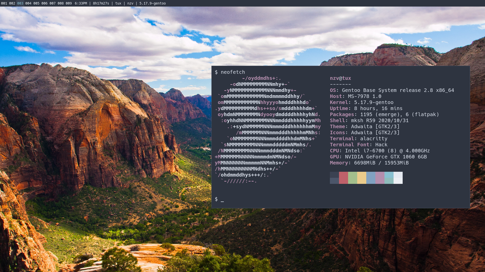
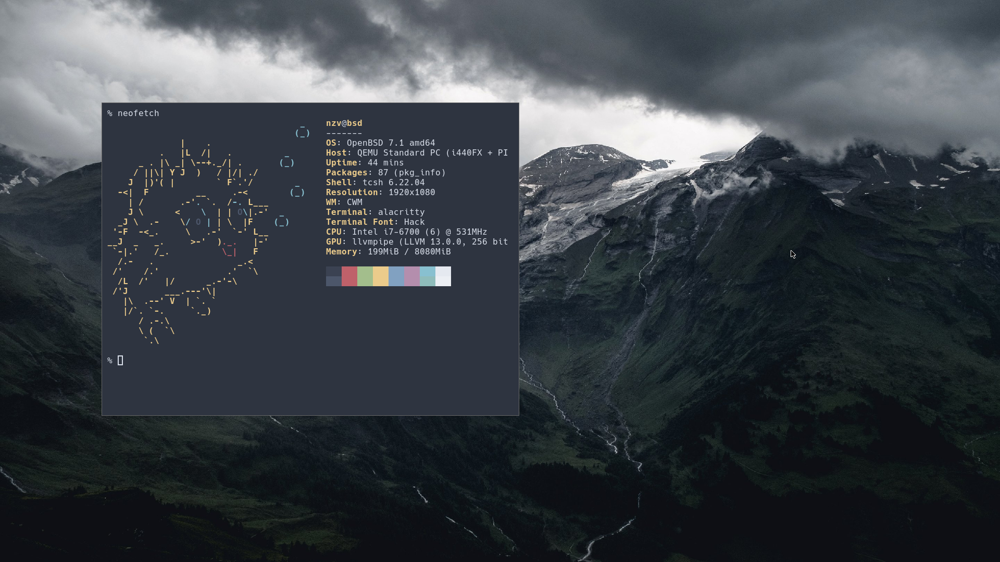

## NAME
me - home dir

## DESCRIPTION

[Dotfiles] could be a synonym of this

## USAGE

To keep things easy, there's a script to get symlink:

```sh
$ go run make.go 
```

## SCROT





## LICENSE

BSD only, see [LICENSE].

Copyright (C) 2022 Enzo Venturi

[LICENSE]: LICENSE
[Dotfiles]: https://wiki.archlinux.org/title/Dotfiles
